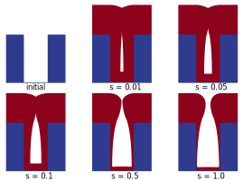
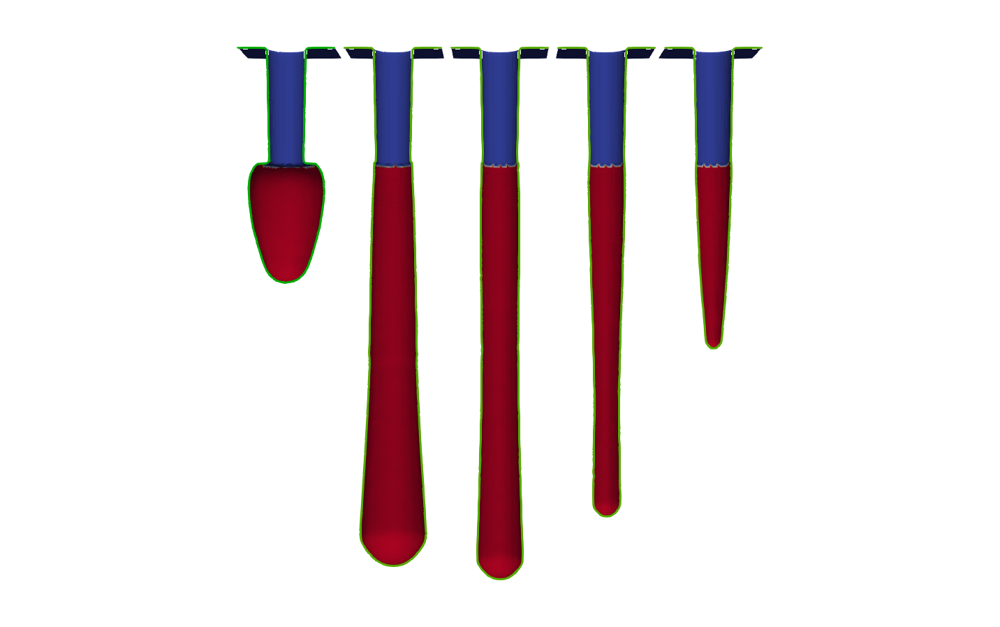
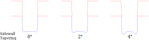
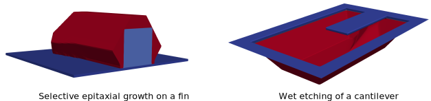

<div align="center">


<h1>ViennaPS - Process Simulation Library</h1>

[](https://github.com/ViennaTools/ViennaPS/actions/workflows/python.yml)
[](https://github.com/ViennaTools/ViennaPS/actions/workflows/build.yml)

</div>

ViennaPS is a header-only C++ process simulation library, which includes surface and volume representations, a ray tracer, and physical models for the simulation of microelectronic fabrication processes. This library seamlessly integrates advanced level-set functionalities with top-down Monte Carlo flux calculations, powered by state-of-the-art ray tracing techniques. This combination brings a new level of accuracy and efficiency to process simulations, empowering engineers and researchers to model complex systems.

> [!NOTE]  
> ViennaPS is under heavy development and improved daily. If you do have suggestions or find bugs, please let us know!

## Releases
Releases are tagged on the master branch and available in the [releases section](https://github.com/ViennaTools/ViennaPS/releases).

## Building

### Supported Operating Systems

* Linux (g++ / clang)

* macOS (XCode)

* Windows (Visual Studio)

### System Requirements

* C++17 Compiler with OpenMP support

### Dependencies (installed automatically)

* [ViennaCore](https://github.com/ViennaTools/viennacore) >= 1.1.0

* [ViennaLS](https://github.com/ViennaTools/viennals) >= 4.0.1
  * [ViennaHRLE](https://github.com/ViennaTools/viennahrle) >= 0.4.0
  * [VTK](https://vtk.org/) >= 9.0.0

* [ViennaRay](https://github.com/ViennaTools/viennaray) >= 3.1.0
  * [Embree](https://www.embree.org/) >= 4.0.0

* [ViennaCS](https://github.com/ViennaTools/viennacs) >= 1.0.0

* [pybind11](https://github.com/pybind/pybind11) >= 2.12.0 (only for building Python libs)

The CMake configuration automatically checks if the dependencies are installed.
If the dependencies are not found on the system, they will be built from source. To use local installations of the dependencies, the `VIENNAPS_LOOKUP_DIRS` variable can be set to the installation path of the dependencies.

## Installing

> [!NOTE]  
> __For more detailed installation instructions and troubleshooting tips, please refer to the ViennaPS [documentation](https://viennatools.github.io/ViennaPS/inst/).__

ViennaPS operates as a header-only library, eliminating the need for a formal installation process. Nonetheless, we advise following the procedure to neatly organize and relocate all header files to a designated directory:

```bash
git clone https://github.com/ViennaTools/ViennaPS.git
cd ViennaPS

cmake -B build && cmake --build build
cmake --install build --prefix "/path/to/your/custom/install/"
```

This will install the necessary headers and CMake files to the specified path. If `--prefix` is not specified, it will be installed to the standard path for your system, usually `/usr/local/` . 

## Building the Python package

The Python package can be built and installed using the `pip` command:

```bash
git clone https://github.com/ViennaTools/ViennaPS.git
cd ViennaPS

pip install .
```

> Some functionalities of the ViennaPS Python module only work in combination with the ViennaLS Python module. It is therefore recommended to additionally install the ViennaLS Python module on your system. Instructions to do so can be found in the [ViennaLS Git Repository](https://github.com/ViennaTools/viennals).

## Using the Python package

The 2D version of the library can be imported as follows:
```python
import viennaps2d as vps
```

In order to switch to three dimensions, only the import needs to be changed:

```python
import viennaps3d as vps
```

## Integration in CMake projects

We recommend using [CPM.cmake](https://github.com/cpm-cmake/CPM.cmake) to consume this library.

* Installation with CPM
  ```cmake
  CPMAddPackage("gh:viennatools/viennaps@3.2.0")
  ```

* With a local installation
    > In case you have ViennaPS installed in a custom directory, make sure to properly specify the [`CMAKE_PREFIX_PATH`](https://cmake.org/cmake/help/latest/envvar/CMAKE_PREFIX_PATH.html#envvar:CMAKE_PREFIX_PATH).

    ```cmake
    list(APPEND CMAKE_PREFIX_PATH "/your/local/installation")

    find_package(ViennaPS)
    target_link_libraries(${PROJECT_NAME} PUBLIC ViennaTools::ViennaPS)
    ```

## Basic Examples

### Building

The examples can be built using CMake:
> __Important__: Make sure all dependencies are installed and have been built previously

```bash
git clone https://github.com/ViennaTools/ViennaPS.git
cd ViennaPS

cmake -B build -DVIENNAPS_BUILD_EXAMPLES=ON
cmake --build build
```

The examples can then be executed in their respective build folders with the config files, e.g.:
```bash
cd examples/exampleName
./ExampleName.bat config.txt # (Windows)
./ExampleName config.txt # (Other)
```

Individual examples can also be build by calling `make` in their respective build folder. An equivalent Python script, using the ViennaPS Python bindings, is also given for each example. 

### Trench Deposition

This example focuses on a particle deposition process within a trench geometry. By default, the simulation presents a 2D representation of the trench. Nevertheless, users have the flexibility to conduct 3D simulations by adjusting the value of the constant _D_ in __trenchDeposition.cpp__ to 3. Customization of process and geometry parameters is achieved through the __config.txt__ file. The accompanying image illustrates instances of the trench deposition process, showcasing variations in the particle sticking probability _s_.

<div align="center">
  
</div>

### SF<sub>6</sub>O<sub>2</sub> Hole Etching

This example demonstrates a hole etching process with a SF<sub>6</sub>O<sub>2</sub> plasma etching chemistry with ion bombardment. The process and geometry parameters can be varied in the __config.txt__ file. 
Below the results for varies flux configurations are shown.

<div align="center">
  
</div>

By changing the dimension of the hole etching example (_D = 2_), we can easily simulate the profile of a trench etching process with the same plasma chemistry. Here we can, for example, vary the mask tapering angle to observe increased micro-trenching, as shown below.

<div align="center">
  
</div>

### Anisotropic Processes

In the anisotropic process model, the etch or deposition rates are dependent on the crystallographic directions of the surface. This enables the accurate modeling of intricate processes like epitaxial growth or anisotropic wet etching. Basic examples, illustrating these processes are provided with the library and shown below.

<div align="center">
  
</div>

### Redeposition During Selective Etching

This example demonstrates capturing etching byproducts and the subsequent redeposition during a selective etching process in a Si<sub>3</sub>N<sub>4</sub>/SiO<sub>2</sub> stack. The etching byproducts are captured in a cell set description of the etching plasma. To model the dynamics of these etching byproducts, a convection-diffusion equation is solved on the cell set using finite differences. The redeposition is then captured by adding up the byproducts in every step and using this information to generate a velocity field on the etched surface. 

<div align="center">
  
</div>

## Tests

ViennaPS uses CTest to run its tests. In order to check whether ViennaPS runs without issues on your system, you can run:

```bash
git clone https://github.com/ViennaTools/ViennaPS.git
cd ViennaPS

cmake -B build -DVIENNAPS_BUILD_TESTS=ON
cmake --build build
ctest -E "Benchmark|Performance" --test-dir build
```

## Application

> [!WARNING] 
> The ViennaPS application is no longer updated with new functionalities added to ViennaPS after release 1.2.0. Please use the Python bindings instead.

It is also possible to build an application which can parse a custom configuration file and execute pre-defined processes. The application can be built using CMake:

```bash
git clone https://github.com/ViennaTools/ViennaPS.git
cd ViennaPS

cmake -B build -DVIENNAPS_BUILD_APPLICATION=ON
cmake --build build
```

This creates 2 executables `ViennaPS2D` and `ViennaPS3D` which run processes in 2 or 3 dimensions respectively. Every configuration file can be run in 2D or 3D mode.

The configuration file must obey a certain structure in order to be parsed correctly. An example for a configuration file can be seen in `SampleConfig.txt`. The configuration file is parsed line by line and each successfully parsed line is executed immediately. A detailed documentation for the configuration file can be found in the [app readme](app/README.md).

## Contributing

If you want to contribute to ViennaCS, make sure to follow the [LLVM Coding guidelines](https://llvm.org/docs/CodingStandards.html).

Make sure to format all files before creating a pull request:
```bash
cmake -B build
cmake --build build --target format
```

## Authors

Current contributors: Tobias Reiter, Noah Karnel, Julius Piso

Contact us via: viennatools@iue.tuwien.ac.at

ViennaPS was developed under the aegis of the 'Institute for Microelectronics' at the 'TU Wien'.
http://www.iue.tuwien.ac.at/

License
--------------------------
See file LICENSE in the base directory.
