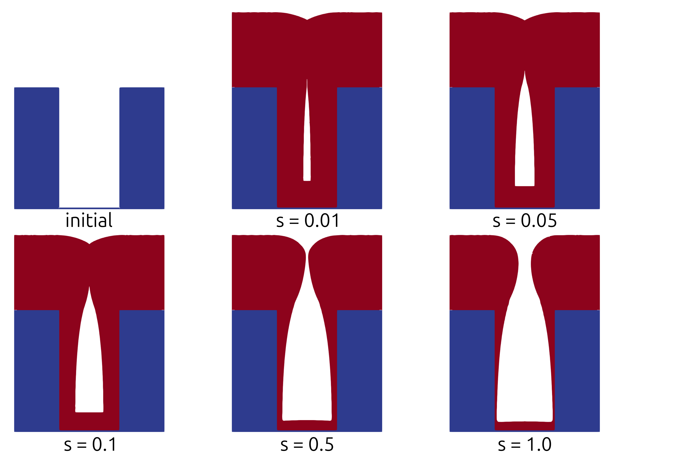
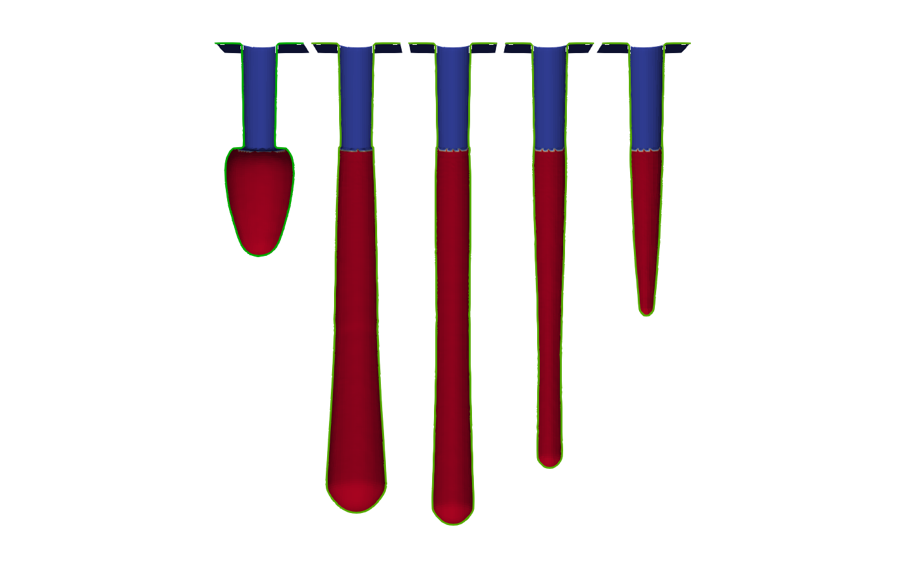
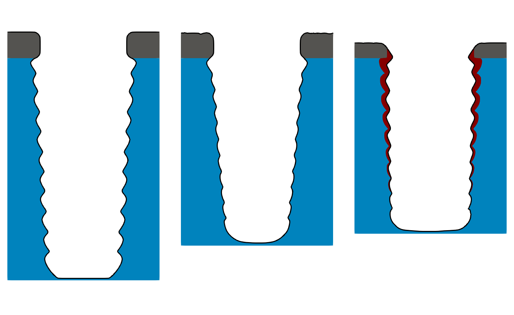
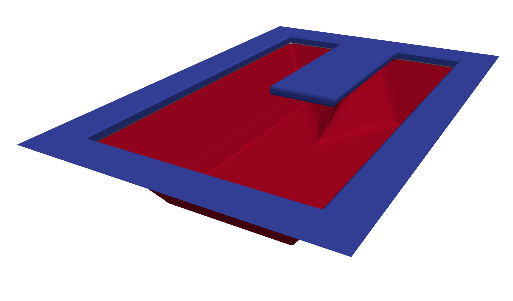
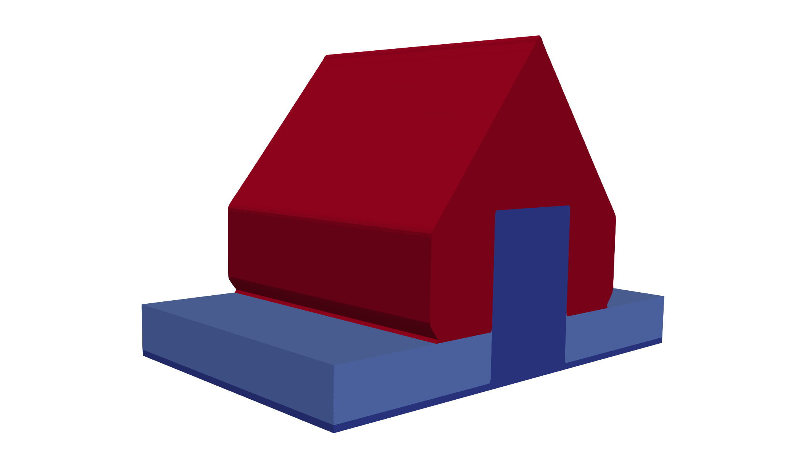
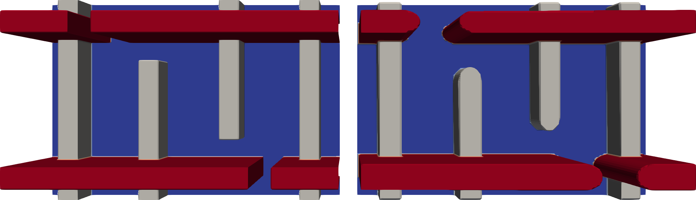
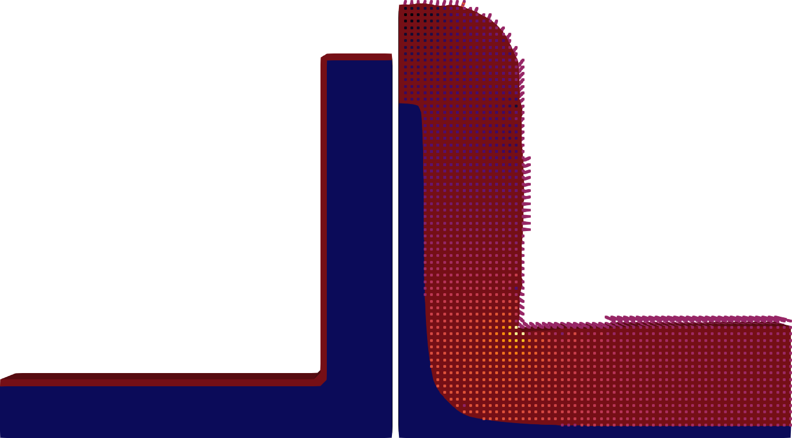
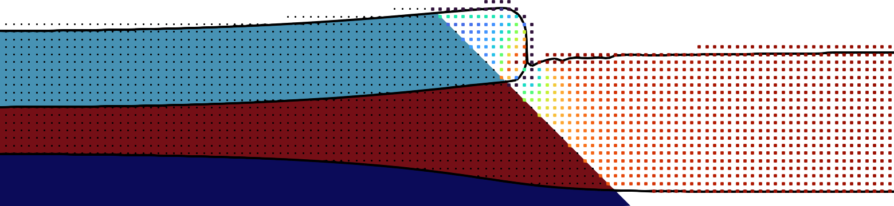

<div align="center">

<picture>
  <source srcset="https://raw.githubusercontent.com/ViennaTools/ViennaPS/master/assets/ViennaPS_title-dark.png" media="(prefers-color-scheme: dark)">
  <source srcset="https://raw.githubusercontent.com/ViennaTools/ViennaPS/master/assets/ViennaPS_title.png" media="(prefers-color-scheme: light)">
  
</picture>

---
 
[](https://github.com/ViennaTools/ViennaPS/actions/workflows/python.yml)
[](https://github.com/ViennaTools/ViennaPS/actions/workflows/build.yml)
[](https://pypi.org/project/ViennaPS/)

</div>

ViennaPS is a header-only C++ library for process and topography simulation in microelectronic fabrication. It models the evolution of 2D and 3D surfaces during etching, deposition, oxidation, and related steps, combining advanced level-set methods for surface evolution with Monte Carlo ray tracing for flux calculation and physics-based solvers for coupled processes. The oxidation model couples oxidant diffusion and viscous flow with nitride mask deformation.

ViennaPS supports both physics-based process models and fast emulation approaches, enabling flexible and efficient development of semiconductor processes. It can be easily integrated into existing C++ projects and also provides Python bindings for use in Python-based workflows. The library is actively developed and continuously improved to address the needs of process and topography simulation in microelectronics.

## Quick Start  

To install ViennaPS for Python, simply run:  

```sh
pip install ViennaPS
```

To use ViennaPS in C++ follow the CMake instructions below. A ready-to-use CMake template is also available for a quick start: [ViennaPS CMake Template](https://viennatools.github.io/ViennaPS/inst/#cmake-template).

For full documentation, visit [ViennaPS Documentation](https://viennatools.github.io/ViennaPS/).

## Citation

If you use ViennaPS, please cite the following paper:

T. Reiter and L. Filipovic, [ViennaPS: A flexible framework for semiconductor process simulation](https://doi.org/10.1016/j.softx.2025.102453), *SoftwareX*, **32**, 102453 (2025).

## Releases

> [!NOTE]  
> ViennaPS is under active development. If you do have suggestions or find bugs, please let us know!

Releases are tagged on the master branch and available in the [releases section](https://github.com/ViennaTools/ViennaPS/releases).

ViennaPS is also available on the [Python Package Index (PyPI)](https://pypi.org/project/ViennaPS/) for most platforms.  

## Building

### Supported Operating Systems

* Linux (g++ / clang)

* macOS (clang)

* Windows (MSVC)

### System Requirements

* C++20 Compiler with OpenMP support

### ViennaTools Dependencies (installed automatically)

ViennaPS is part of the ViennaTools ecosystem and depends on several lightweight, header-only ViennaTools libraries. During configuration, CMake will fetch them automatically as part of the ViennaPS build. No separate installation step is required for these dependencies:

* [ViennaCore](https://github.com/ViennaTools/viennacore) 
* [ViennaLS](https://github.com/ViennaTools/viennals) 
* [ViennaHRLE](https://github.com/ViennaTools/viennahrle) 
* [ViennaRay](https://github.com/ViennaTools/viennaray) 
* [ViennaCS](https://github.com/ViennaTools/viennacs)

### External Dependencies

The following external dependencies are required to build ViennaPS. On most systems, installing them via a package manager (e.g. `apt`, `brew`, or `vcpkg`) is the fastest option:

* [VTK](https://vtk.org/) (9.0.0+)
* [Embree](https://www.embree.org/) (4.0.0+)

CMake automatically checks for these dependencies during configuration. If they are not found, they can be built from source as part of the build.

To prefer a specific local installation, point CMake to it via `VIENNAPS_LOOKUP_DIRS` (a semicolon-separated list of prefixes):

```bash
cmake -B build -DVIENNAPS_LOOKUP_DIRS="/path/to/vtk;/path/to/embree"
```

Alternatively (or additionally), you can use `CMAKE_PREFIX_PATH` if that better matches your local setup.

## Installing

> [!NOTE]  
> __For more detailed installation instructions and troubleshooting tips, have a look at the ViennaPS [documentation](https://viennatools.github.io/ViennaPS/inst/).__

ViennaPS is a header-only library, so no formal installation is required. To use ViennaPS in your C++ project, refer to the [Integration in CMake projects](#integration-in-cmake-projects) section below.

## Building the Python package locally

The Python package can be built and installed using the `pip` command:

```bash
git clone https://github.com/ViennaTools/ViennaPS.git
cd ViennaPS

pip install .
```

To build the Python package with **GPU** support, use the install script in `python/scripts` folder. On Linux, e.g., run:
```bash
python3 -m venv .venv # create virtual environment (optional, but recommended)
source .venv/bin/activate # activate virtual environment 
python python/scripts/install_ViennaPS.py
```
A CUDA toolkit and driver compatible with your GPU must be installed on your system to use the GPU functionality.

> Some features of the ViennaPS Python module depend on the ViennaLS Python module. The ViennaLS is installed automatically as a dependency.
> Note: A locally built ViennaPS Python module is typically not compatible with the ViennaLS package from PyPI. For details and troubleshooting, see [this guide](https://viennatools.github.io/ViennaPS/inst/troubleshooting.html#python-importerror).

## Using the Python package

The ViennaPS Python package can be used by importing it in your Python scripts:
```python
import viennaps as vps
```

By default, ViennaPS operates in two dimensions. You can set the dimension using:
```python
vps.setDimension(2)  # For 2D simulations
vps.setDimension(3)  # For 3D simulations
```

For more details and examples, refer to the official [documentation](https://viennatools.github.io/ViennaPS/).

## Integration in CMake projects

We recommend using [CPM.cmake](https://github.com/cpm-cmake/CPM.cmake) to consume this library.

* Installation with CPM
  ```cmake
  CPMAddPackage("gh:viennatools/viennaps@4.7.0")

  target_link_libraries(${PROJECT_NAME} PUBLIC ViennaTools::ViennaPS)
  ```

* With a local installation
    > In case you have ViennaPS installed in a custom directory, make sure to properly specify the [`CMAKE_PREFIX_PATH`](https://cmake.org/cmake/help/latest/envvar/CMAKE_PREFIX_PATH.html#envvar:CMAKE_PREFIX_PATH).

    ```cmake
    list(APPEND CMAKE_PREFIX_PATH "/your/local/installation")

    find_package(ViennaPS)
    target_link_libraries(${PROJECT_NAME} PUBLIC ViennaTools::ViennaPS)
    ```

    > Note: If you installed ViennaPS to a custom location, GPU kernels can not be built, since the CMake configuration does not support this setup. If you need GPU support, please use CPM.cmake.

### Shared Library

In order to save build time during development, dynamically linked shared libraries can be used if ViennaPS was built with them. This is done by precompiling the most common template specialisations. In order to use shared libraries, use

```bash
cmake -B build -DVIENNAPS_PRECOMPILE_HEADERS=ON
```

If ViennaPS was built with shared libraries and you use ViennaPS in your project (see above), CMake will automatically link them to your project.

## GPU Acceleration

ViennaPS supports GPU acceleration for the ray tracing part of the library (since v3.4.0) and for the diffusion solver in the physics-based oxidation model. Both GPU features are still experimental. Details on how to enable GPU functionality can be found in the [documentation](https://viennatools.github.io/ViennaPS/inst/gpu.html).

## Basic Examples

See the [examples README](examples/README.md) for build and run instructions, detailed descriptions, and images.

| Example | Description | Preview |
| --- | --- | --- |
| [Trench Deposition](examples/README.md#trench-deposition) | Particle deposition in a trench with varying sticking probabilities. |  |
| [SF₆/O₂ Hole Etching](examples/README.md#sf6o2-hole-etching) | Plasma etching with ion bombardment and varying particle fluxes. |  |
| [Bosch Process](examples/README.md#bosch-process) | Comparison of emulation and physical models for deep reactive ion etching. |  |
| [Wet Etching](examples/README.md#wet-etching) | Crystallographic wet etching of a cantilever structure. |  |
| [Selective Epitaxy](examples/README.md#selective-epitaxy) | Crystallographic SiGe growth on a silicon substrate. |  |
| [Redeposition During Selective Etching](examples/README.md#redeposition-during-selective-etching) | Byproduct transport and oxide regrowth in a Si₃N₄/SiO₂ stack. |  |
| [GDS Mask Import](examples/README.md#gds-mask-import-example) | GDS mask transformations and conversion to level sets. |  |
| [Fin Oxidation](examples/README.md#fin-oxidation) | Thermal oxidation of a silicon fin with anisotropic growth. |  |
| [LOCOS Oxidation](examples/README.md#locos-oxidation) | Local oxidation beneath a nitride mask with bird's beak formation. |  |

## Publications Using ViennaPS

The following publications use ViennaPS for semiconductor process simulation:

* [Physics-Based Multi-Scale Modeling of Angled Reactive Ion Etching](https://doi.org/10.1109/SISPAD66650.2025.11186317). *SISPAD* (2025).
* [Simulation of a Polymer-Free DRIE Process Using SF₆/O₂ Plasma Etching](https://doi.org/10.1109/SISPAD66650.2025.11186394). *SISPAD* (2025).
* [Equipment-Informed Machine Learning-Assisted Feature-Scale Plasma Etching Model](https://doi.org/10.1109/SISPAD62626.2024.10733099). *SISPAD* (2024).
* [Loading Effect during SiGe/Si Stack Selective Isotropic Etching for Gate-All-Around Transistors](https://doi.org/10.1021/acsaelm.4c01462). *ACS Applied Electronic Materials* (2024).
* [Effect of Mask Geometry Variation on Plasma Etching Profiles](https://doi.org/10.3390/mi14030665). *Micromachines* (2023).
* [Modeling Oxide Regrowth During Selective Etching in Vertical 3D NAND Structures](https://doi.org/10.23919/SISPAD57422.2023.10319506). *SISPAD* (2023).
* [Impact of Plasma Induced Damage on the Fabrication of 3D NAND Flash Memory](https://doi.org/10.1016/j.sse.2022.108261). *Solid-State Electronics* (2022).

## Tests

ViennaPS uses CTest to run its tests. In order to check whether ViennaPS runs without issues on your system, you can run:
```bash
cmake -B build -DVIENNAPS_BUILD_TESTS=ON
cmake --build build
ctest -E "Benchmark|Performance" --test-dir build
```

## Contributing

If you want to contribute to ViennaPS, make sure to follow the [LLVM Coding guidelines](https://llvm.org/docs/CodingStandards.html).

Make sure to format all files before creating a pull request:
```bash
cmake -B build
cmake --build build --target format
```

## Authors

Contact us via: viennatools@iue.tuwien.ac.at

ViennaPS was developed under the aegis of the 'Institute for Microelectronics' at the 'TU Wien'.
http://www.iue.tuwien.ac.at/

## License

Versions < 4.3.0 were released under MIT License. Starting with version 4.3.0, the project is licensed under GPL-3.0 License. For more details, please refer to the [LICENSE](./LICENSE) file in the base directory of the repository.

Some third-party libraries used by ViennaPS are under their own permissive licenses (BSD, Apache-2.0).  
See [`THIRD_PARTY_LICENSES.md`](./THIRD_PARTY_LICENSES.md) for details.
