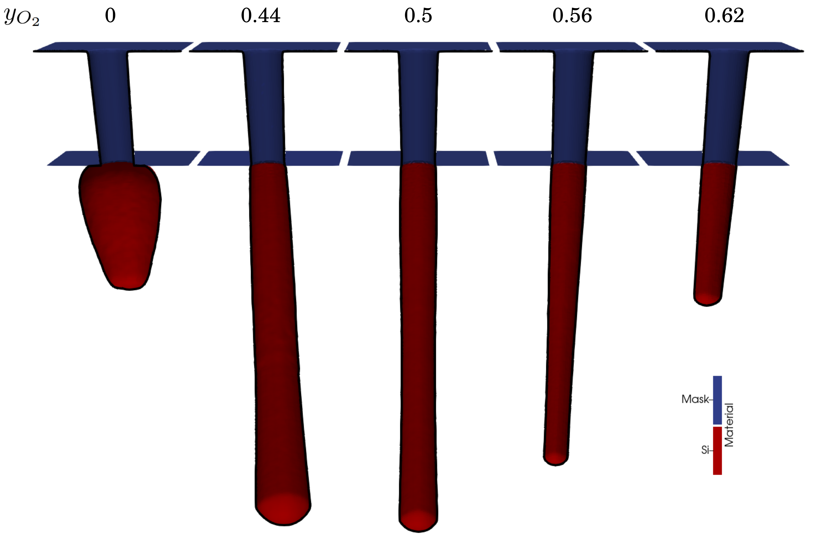

<div align="center">


<h1>ViennaPS - Process Simulation Library</h1>

[](https://github.com/ViennaTools/ViennaPS/actions/workflows/python.yml)
[](https://github.com/ViennaTools/ViennaPS/actions/workflows/build.yml)
[](https://pypi.org/project/ViennaPS/)

</div>

ViennaPS is a header-only C++ library for simulating microelectronic fabrication processes. It combines surface and volume representations with advanced level-set methods and Monte Carlo flux calculations, powered by high-performance ray tracing. Users can develop custom models, use pre-configured physical models, or leverage emulation for flexible and efficient process simulations.

ViennaPS is designed to be easily integrated into existing C++ projects and provides Python bindings for seamless use in Python environments. The library is under active development and is continuously improved to meet the evolving needs of process simulation in microelectronics.

> [!NOTE]  
> ViennaPS is under heavy development and improved daily. If you do have suggestions or find bugs, please let us know!

## Quick Start  

To install ViennaPS for Python, simply run:  

```sh
pip install ViennaPS
```

To use ViennaPS in C++, clone the repository and follow the installation steps below.

For full documentation, visit [ViennaPS Documentation](https://viennatools.github.io/ViennaPS/).

## Releases
Releases are tagged on the master branch and available in the [releases section](https://github.com/ViennaTools/ViennaPS/releases).

ViennaPS is also available on the [Python Package Index (PyPI)](https://pypi.org/project/ViennaPS/) for most platforms.  

## Building

### Supported Operating Systems

* Linux (g++ / clang)

* macOS (XCode)

* Windows (Visual Studio)

### System Requirements

* C++17 Compiler with OpenMP support

### Dependencies (installed automatically)

* [ViennaCore](https://github.com/ViennaTools/viennacore) (1.4.3+)

* [ViennaLS](https://github.com/ViennaTools/viennals) (4.3.2+)
  * [ViennaHRLE](https://github.com/ViennaTools/viennahrle) (0.6.0+)
  * [VTK](https://vtk.org/) (9.0.0+)

* [ViennaRay](https://github.com/ViennaTools/viennaray) (3.4.1+)
  * [Embree](https://www.embree.org/) (4.0.0+)

* [ViennaCS](https://github.com/ViennaTools/viennacs) (1.1.0+)

* [pybind11](https://github.com/pybind/pybind11) (2.12.0+, only for building Python libs)

The CMake configuration automatically checks if the dependencies are installed.
If the dependencies are not found on the system, they will be built from source. To use local installations of the dependencies, the `VIENNAPS_LOOKUP_DIRS` variable can be set to the installation path of the dependencies.

## Installing

> [!NOTE]  
> __For more detailed installation instructions and troubleshooting tips, please refer to the ViennaPS [documentation](https://viennatools.github.io/ViennaPS/inst/).__

ViennaPS is a header-only library, so no formal installation is required. However, following the steps below helps organize and manage dependencies more effectively:

```bash
git clone https://github.com/ViennaTools/ViennaPS.git
cd ViennaPS

cmake -B build && cmake --build build
cmake --install build --prefix "/path/to/your/custom/install/"
```

This will install the necessary headers and CMake files to the specified path. If `--prefix` is not specified, it will be installed to the standard path for your system, usually `/usr/local/` . 

## Building the Python package

The Python package can be built and installed using the `pip` command:

```bash
git clone https://github.com/ViennaTools/ViennaPS.git
cd ViennaPS

pip install .
```

> Some features of the ViennaPS Python module require the ViennaLS Python module. It is therefore recommended to additionally install the ViennaLS Python module on your system. Instructions to do so can be found in the [ViennaLS Git Repository](https://github.com/ViennaTools/viennals).

## Using the Python package

The 2D version of the library can be imported as follows:
```python
import viennaps2d as vps
```

In order to switch to three dimensions, only the import needs to be changed:

```python
import viennaps3d as vps
```

## Integration in CMake projects

We recommend using [CPM.cmake](https://github.com/cpm-cmake/CPM.cmake) to consume this library.

* Installation with CPM
  ```cmake
  CPMAddPackage("gh:viennatools/viennaps@3.5.1")
  ```

* With a local installation
    > In case you have ViennaPS installed in a custom directory, make sure to properly specify the [`CMAKE_PREFIX_PATH`](https://cmake.org/cmake/help/latest/envvar/CMAKE_PREFIX_PATH.html#envvar:CMAKE_PREFIX_PATH).

    ```cmake
    list(APPEND CMAKE_PREFIX_PATH "/your/local/installation")

    find_package(ViennaPS)
    target_link_libraries(${PROJECT_NAME} PUBLIC ViennaTools::ViennaPS)
    ```

## GPU Acceleration (Experimental)

As of version 3.4.0, ViennaPS supports GPU acceleration for the ray tracing part of the library. This feature is still experimental and may not work on all systems. Details on how to enable GPU functionality can be found in the [documentation](https://viennatools.github.io/ViennaPS/inst/).

## Basic Examples

### Building

The examples can be built using CMake:
> __Important__: Make sure all dependencies are installed and have been built previously

```bash
git clone https://github.com/ViennaTools/ViennaPS.git
cd ViennaPS

cmake -B build -DVIENNAPS_BUILD_EXAMPLES=ON
cmake --build build
```

The examples can then be executed in their respective build folders with the config files, e.g.:
```bash
cd examples/exampleName
./exampleName.bat config.txt # (Windows)
./exampleName config.txt # (Other)
```

Individual examples can also be build by calling `make` in their respective build folder. An equivalent Python script, using the ViennaPS Python bindings, is also given for each example. 

### Trench Deposition

This [example](https://github.com/ViennaTools/ViennaPS/tree/master/examples/trenchDeposition) focuses on a particle deposition process within a trench geometry. By default, the simulation presents a 2D representation of the trench. Nevertheless, users have the flexibility to conduct 3D simulations by adjusting the value of the constant _D_ in __trenchDeposition.cpp__ to 3. Customization of process and geometry parameters is achieved through the __config.txt__ file. The accompanying image illustrates instances of the trench deposition process, showcasing variations in the particle sticking probability _s_.

<div align="center">
  
</div>

### SF<sub>6</sub>O<sub>2</sub> Hole Etching

This [example](https://github.com/ViennaTools/ViennaPS/tree/master/examples/holeEtching) demonstrates a hole etching process with a SF<sub>6</sub>O<sub>2</sub> plasma etching chemistry with ion bombardment. The process is controlled by various parameters, including geometry and plasma conditions, which can be adjusted in the __config.txt__ file.

The image presents the results of different flux configurations, as tested in _testFluxes.py_. Each structure represents a variation in flux conditions, leading to differences in hole shape, depth, and profile characteristics. The variations highlight the influence of ion and neutral fluxes on the etching process.

> [!NOTE] 
> The underlying model may change in future releases, so running this example in newer versions of ViennaPS might not always reproduce exactly the same results.  
> The images shown here were generated using **ViennaPS v3.3.0**.

<div align="center">
  
</div>

### Bosch Process

This [example](https://github.com/ViennaTools/ViennaPS/tree/master/examples/boschProcess) compares different approaches to simulating the Bosch process, a deep reactive ion etching (DRIE) technique. The three structures illustrate how different modeling methods influence the predicted etch profile.

- Left: The structure generated through process emulation, which captures the characteristic scalloping effect of the Bosch process in a simplified yet effective way.
- Middle: The result of a simple simulation model, which approximates the etching dynamics but may lack finer physical details.
- Right: The outcome of a more physical simulation model, leading to a more realistic etch profile.
  
This comparison highlights the trade-offs between computational efficiency and physical accuracy in DRIE simulations.

<div align="center">
  
</div>


### Anisotropic Processes

In the anisotropic process model, the etch or deposition rates are dependent on the crystallographic directions of the surface. This enables the accurate modeling of intricate processes like [epitaxial growth](https://github.com/ViennaTools/ViennaPS/tree/master/examples/selectiveEpitaxy) or [anisotropic wet etching](https://github.com/ViennaTools/ViennaPS/tree/master/examples/cantileverWetEtching). Basic examples, illustrating these processes are provided with the library and shown below.

<div align="center">
  
</div>

### Redeposition During Selective Etching

This [example](https://github.com/ViennaTools/ViennaPS/tree/master/examples/oxideRegrowth) demonstrates capturing etching byproducts and the subsequent redeposition during a selective etching process in a Si<sub>3</sub>N<sub>4</sub>/SiO<sub>2</sub> stack. The etching byproducts are captured in a cell set description of the etching plasma. To model the dynamics of these etching byproducts, a convection-diffusion equation is solved on the cell set using finite differences. The redeposition is then captured by adding up the byproducts in every step and using this information to generate a velocity field on the etched surface. 

<div align="center">
  
</div>

### GDS Mask Import Example

This [example](https://github.com/ViennaTools/ViennaPS/tree/master/examples/GDSReader) tests the full GDS mask import, blurring, rotation, scaling, and flipping as well as the level set conversion pipeline. Shown below is the result after applying proximity correction and extrusion on a simple test.

<div align="center">
  
</div>


## Tests

ViennaPS uses CTest to run its tests. In order to check whether ViennaPS runs without issues on your system, you can run:

```bash
git clone https://github.com/ViennaTools/ViennaPS.git
cd ViennaPS

cmake -B build -DVIENNAPS_BUILD_TESTS=ON
cmake --build build
ctest -E "Benchmark|Performance" --test-dir build
```

## Contributing

If you want to contribute to ViennaPS, make sure to follow the [LLVM Coding guidelines](https://llvm.org/docs/CodingStandards.html).

Make sure to format all files before creating a pull request:
```bash
cmake -B build
cmake --build build --target format
```

## Authors

Current contributors: Tobias Reiter, Lado Filipovic, Roman Kostal, Noah Karnel

Contact us via: viennatools@iue.tuwien.ac.at

ViennaPS was developed under the aegis of the 'Institute for Microelectronics' at the 'TU Wien'.
http://www.iue.tuwien.ac.at/

License
--------------------------
See file LICENSE in the base directory.